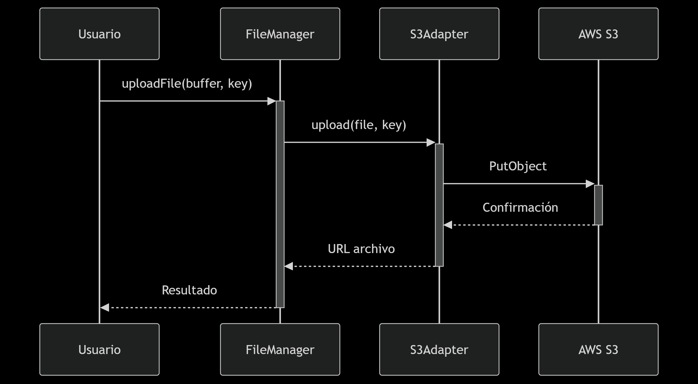

# **Artefacto Reutilizable AWS S3**
**AWS S3**
**TypeScript**
**Arquitectura Hexagonal**

### Arquitectura
📁 s3-artifact/
├── 📁 src/
│   ├── 📁 core/                  # Lógica de negocio
│   │   ├── 📁 ports/             # Interfaces/Puertos
│   │   │   └── 📄 StoragePort.ts # Interfaz para almacenamiento
│   │   └── 📁 useCases/          # Casos de uso
│   │       └── 📄 FileManager.ts # Servicio principal
│   │
│   ├── 📁 infrastructure/        # Implementaciones concretas
│   │   └── 📁 aws/
│   │       └── 📄 S3Adapter.ts   # Adaptador para AWS S3
│   │
│   └── 📁 shared/                # Utilidades compartidas
│       ├── 📁 errors/
│       │   └── 📄 StorageError.ts# Errores personalizados
│       ├── 📁 logger/
│       │   └── 📄 logger.ts      # Logger con Winston
│       └── 📁 metrics/
│           └── 📄 MetricsService.ts # Métricas de operaciones
│
├── 📁 tests/
│   ├── 📁 unit/
│   │   ├── 📄 FileManager.test.ts
│   │   ├── 📄 S3Adapter.test.ts
│   │   └── 📄 MetricsService.test.ts
│   └── 📁 integration/
│       └── 📄 s3Operations.test.ts
│
├── 📁 examples/                  # Ejemplos de uso
│   └── 📄 basicUsage.ts
│
├── 📄 .eslintrc.js               # Configuración ESLint
├── 📄 .prettierrc                # Configuración Prettier
├── 📄 jest.config.js             # Configuración Jest
├── 📄 tsconfig.json              # Configuración TypeScript
└── 📄 package.json               # Dependencias

### 📌 Descripción
Este proyecto proporciona una capa de abstracción reutilizable para interactuar con AWS S3, implementando Clean Code y Arquitectura Hexagonal. Permite:

✅ Operaciones básicas (upload/download/delete/list)
✅ Manejo de errores estandarizado
✅ Fácil integración en otros proyectos
✅ 100% cobertura de pruebas

### 🚀 Instalación
````bash
npm install artefacto-s3-reutilizable
# o
yarn add artefacto-s3-reutilizable
````

### 💻 Uso Básico

````
import { S3Adapter, FileManager } from 'artefacto-s3-reutilizable';

// 1. Configuración
const s3Adapter = new S3Adapter(process.env.AWS_BUCKET!, process.env.AWS_REGION!);
const fileManager = new FileManager(s3Adapter);

// 2. Subir archivo
await fileManager.uploadFile(Buffer.from('contenido'), 'ruta/archivo.txt');

// 3. Descargar archivo
const contenido = await fileManager.downloadFile('ruta/archivo.txt');

// 4. Listar archivos
const archivos = await fileManager.listFiles('ruta/');

// 5. Eliminar archivo
await fileManager.deleteFile('ruta/archivo.txt');
````
### Estructura del Código
- ✅  **Core (Lógica de Negocio)**
  - **FileManager**: Orquesta las operaciones
  - **StoragePort**: Interfaz para implementaciones de almacenamiento

- ✅  **Infrastructure**
  - **S3Adapter**: Implementación concreta para AWS S3
  - **logger**: Configuración centralizada de logging
  - **MetricsService**: Tracking de operaciones

- ✅  **Shared**
  - **StorageError**: Errores personalizados
  - Tipos y utilidades compartidas
### 🧪 Testing
````
# Ejecutar pruebas unitarias
npm run test

# Pruebas desarrollo
npm run test:dev
````
### 🛠 Métodos Disponibles
FileManager

| Metodo | Parámetros | Retorno | Descripción |
|--|--|--|--|
| `uploadFile` | `file: Buffer, key: string` | `Promise<string>` | Sube archivo a S3 |
| `downloadFile` | `key: string` | `Promise<Buffer>` | `Descarga archivo` |
| `deleteFile` | `key: string` | `Promise<void>` | `Elimina archivo` |
| `listFiles` | `prefix?: string` | `Promise<string[]>` | `Lista archivos` |

### 🚨 Manejo de Errores
El proyecto usa StorageError con:

- Mensaje descriptivo

- Código único de error

- Metadatos adicionales

Ejemplo de captura:
````
try {
  await fileManager.uploadFile(buffer, key);
} catch (error) {
  if (error instanceof StorageError) {
    console.error(`Error ${error.code}:`, error.message);
  }
}
````

### 🌐 Ambiente de Producción
Recomendaciones:

- Usa IAM Roles en lugar de credenciales hardcodeadas

- Configura timeouts apropiados

- Implementa retry policies para errores transientes

### 🔄 Flujo de Operaciones
